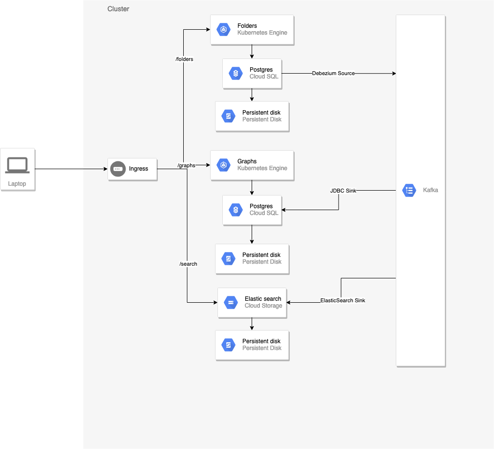

# High-level cluster diagram



# How to start

Make sure minikube has enough resources:
```shell script
minikube start --cpus 4 --memory 15000 --disk-size 40000mb
```

## Skaffold
1. Create postgress secret and enable ingress
```shell script
kubectl create secret generic pgpassword --from-literal POSTGRES_PASSWORD=my_pgpassword
minikube addons enable ingress
```

1.5. Apply persistent volume claim. This is done separately so that skaffold dev doesn't clean up db on restarts
```shell script
./db-helpers/pvc-apply.sh
```

1.6. (Don't do this) Build custom debezium connect JDBC image.
```shell script
docker build -t d0rka/debezium-connect-jdbc:1.2 ./debezium-jdbc
docker push d0rka/debezium-connect-jdbc:1.2
```

2. Init kafka. Sometimes this takes quite long (~5min)
```shell script
helm install my-kafka confluent/cp-helm-charts -f k8s-kafka/values.yaml
```
Can be updated with
```shell script
helm upgrade my-kafka confluent/cp-helm-charts -f k8s-kafka/values.yaml
```
Can be uninstalled with
```shell script
helm uninstall my-kafka
```

2.5 Init elastic search
```shell script
helm install my-elasticsearch stable/elasticsearch -f k8s-elasticsearch/values.yaml
```
Can be updated with
```shell script
helm upgrade my-elasticsearch stable/elasticsearch -f k8s-elasticsearch/values.yaml
```
Can be uninstalled with
```shell script
helm uninstall my-elasticsearch
kubectl delete pvc -l release=my-elasticsearch,component=data
```

3. Start dev
```shell script
skaffold dev
```

4. Create db's and migrate
```shell script
./db-helpers/create-db.sh
./db-helpers/migrate.sh
```

4.5. Start kafka-client
```shell script
./kafka-helpers/client.sh
```

5. Upload sources and sinks
```shell script
./kafka-helpers/upload-source-folders.sh
./kafka-helpers/upload-sink-folders-db-graphs.sh
./kafka-helpers/upload-sink-folders-es.sh
```

### Navigate to (there is insomnia config also)

<minikube-ip>/folders
<minikube-ip>/graphs

#Memos

The reason why Dockerfiles use yarn is that I experienced some really weird behaviour with npm. When I added
class-validator and class-transformer to package.json and ran docker-compose up npm install did not install
these. When sh to the container you could see that package.json is correct but ls node_modules | grep class
showed that the packages are not there.

Trouble with skaffold: At some point skaffold dev simply did not stabilize the deployments. All stayed at Pending
state. I was not able to figure out the exact reason for this but it might be related to missing space. At 
that time I also started to get a lot of `no space left on device` errors. I pruned everything and skaffold started
working
`docker system prune`

`docker volume prune`

Trouble with kafka: If strimzi fails to start it might be that KubernetesClient and Kubernetes versions are not
compatible. Try starting the minikube with an older version `minikube start --kubernetes-version v1.15.3`
https://github.com/strimzi/strimzi-kafka-operator/issues/2920

## Kafka

List topics:
```shell script
./kafka-helpers/ssh.sh
kafka-topics --zookeeper my-kafka-cp-zookeeper-headless:2181 --list
```

Delete topic:
```shell script
./kafka-helpers/ssh.sh
kafka-topics --zookeeper my-kafka-cp-zookeeper-headless:2181 --delete --topic folders
```

Consume topic:
```shell script
./kafka-helpers/ssh.sh
kafka-console-consumer --bootstrap-server my-kafka-cp-kafka-headless:9092 --topic folders --from-beginning
```

# TODOS:
- What happens on transactional db modifications when the transaction fails and is rolled back?
- What happens if message broker goes offline and local db stays online?
- How long do topics need to be persisted?
- How many times are the events being sent and how many times are they received?

# Features:
- Import with FileStreamSource
- Export with FileStreamSink
- Same with HTTPSource/Sink?
